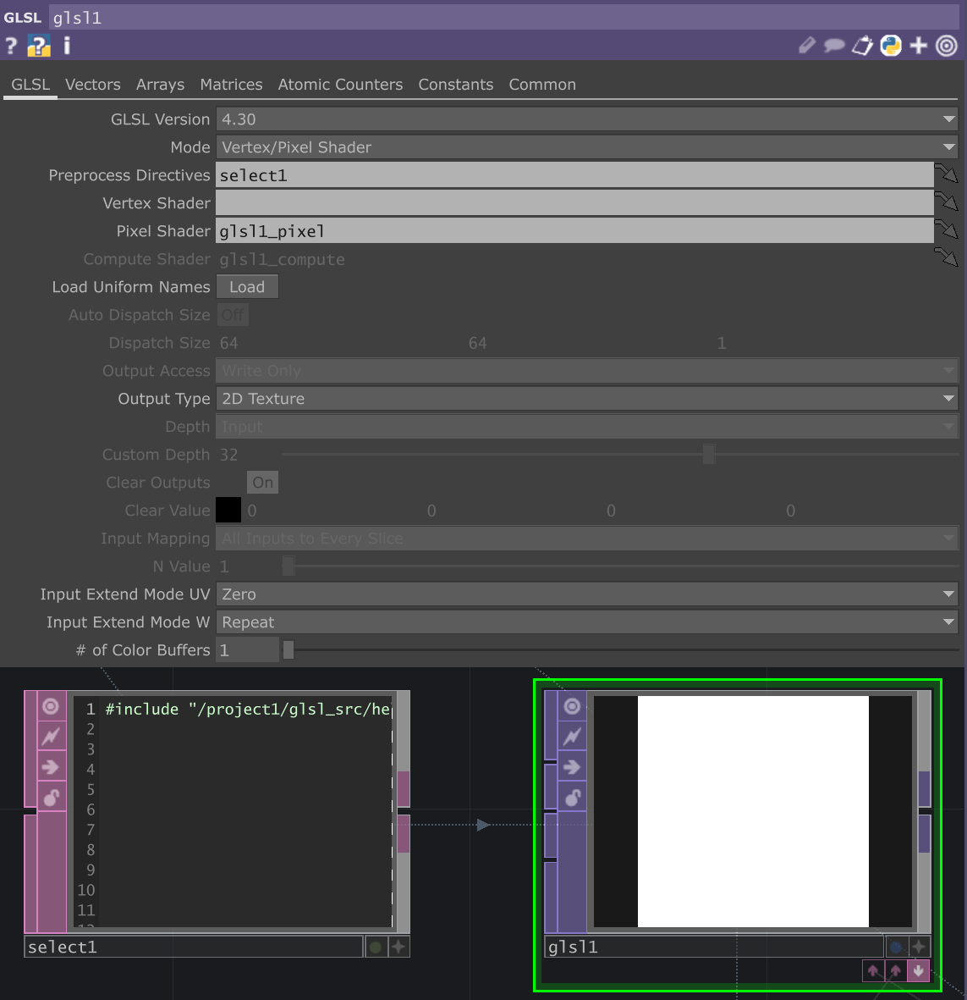

# GLSL helpers
A reusable asset to bring GLSL helper functions into your TouchDesigner project. 

## Usage
To use, simply drag the `release/glsl.tox` file into your project. Alternatively you can download the same file from the github release page.

### Including in a GLSL TOP
To include the code you can directly include using the `#include` directive in your GLSL code.
```c
#include "/project1/glsl/helpers"
```
Please note this path will change depending on where you place the asset. To make it location agnostic create a `select DAT` and set DAT path to expression mode and type `op.glsl.op("include_helpers")`. You can now use that `select DAT` as the `Preprocess Directives DAT` in your `GLSL TOP`  



### Adding custom functions
You can add custom functions and defines by creating valid glsl code in a `text DAT` and connecting it to the COMP's `Custom GLSL` field on the `Config` page. Please note that to have your functions definitions show up in the helper list you must use tabs rather than spaces.

### Viewing functions
You can get a list of the functions by viewing the table `./functions`. In python you can call the function `op.glsl.ListFunctions()` to get a list of the names of the functions. 
